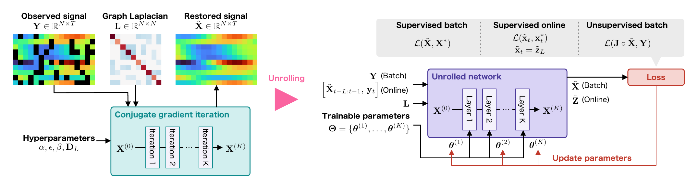

GLASS
====

[](https://arxiv.org/abs/2610.11359)
[](https://arxiv.org/abs/2610.11359)
[]()
[](https://www.sip.comm.eng.osaka-u.ac.jp/)

Official PyTorch implementation of **GLASS** (restoration of time-varying **G**raph signals with **L**earned **A**daptive **S**patiotemporal **S**moothness), proposed in "Unrolled Time-Varying Graph Signal Restoration under Spatiotemporal Smoothness Priors".

Our preliminary results were presented in "Restoration of Time-Varying Graph Signals using Deep Algorithm Unrolling" (ICASSP 2023).

[](https://ieeexplore.ieee.org/document/10094838)
[](https://doi.org/10.1109/ICASSP49357.2023.10094838)



## Abstract
> In this paper, we propose restoration methods for time-varying graph signals using deep algorithm unrolling (DAU). Time-varying graph signals, such as signals obtained from sensor networks, are nonuniformly distributed in space and observed as time series. Since these observed signals often contain noise and missing values, their restoration needs to consider both spatial and temporal relationships. Our approach is based on an optimization problem that models signal properties using a spatiotemporal regularizer that combines a Sobolev operator for spatial smoothness and a multi-tap FIR filter for temporal smoothness. We then unroll the iterative conjugate gradient method to solve this problem and learn the regularization parameters and filter coefficients in each iteration. Our method can be applied to supervised batch, supervised online, and unsupervised batch settings to learn these parameters. Experiments on several synthetic and real-world datasets show that the supervised batch method achieves the lowest RMSEs in almost all cases. The supervised online and the unsupervised batch methods outperform the existing methods of their own settings, and are often competitive with the existing batch methods.

## Install
We use [uv](https://docs.astral.sh/uv/) to manage the Python environment.

```bash
git clone https://github.com/kojima-msp/GLASS.git
cd GLASS
uv sync
# datasets (-> ./datasets)
uv run gdown "https://drive.google.com/file/d/1gHi3gYRs0kpEaz0XisgnhqeSQErd-tUC/view?usp=drive_link" -O datasets.zip
unzip -q datasets.zip
```

The trained weights that reproduce the results of the paper are included in `src/models/release/`:

| file | model |
|---|---|
| `batch_<dataset>_L8.pth` | supervised batch |
| `batch_syn_L{1,3,5,10}.pth` | supervised batch, ablation over the number of taps $L$ |
| `online_<dataset>_L8.pth` | supervised online |
| `gcn_<dataset>.pth`, `cheb_<dataset>.pth` | static GNN baselines |

Optionally, the precomputed results (restored signals, tables, figures) are available as `out.zip`, which extracts to `out/`:

```bash
uv run gdown "https://drive.google.com/file/d/1hzdZBphkHonp-0wIhIRp33Qx4nHcWiOn/view?usp=drive_link" -O out.zip
unzip -q out.zip
```

## Usage

Configuration is managed with [Hydra](https://hydra.cc/). Shared settings are in `conf/base.yaml`, and per-dataset settings (regularization parameters of the baselines, paths of the trained weights) are in `conf/dataset/{syn,nys,covid}.yaml`. Select the dataset with `dataset=<syn|nys|covid>` (default `syn`) and override a value in the config as `key=value`. A key that is not in the config is added with a leading `+`, e.g. `+data_idx=12`.

### Quick Start

**Batch**: restores the whole sequence at once.

```python
import torch
from src.methods.proposed_batch_model import Batch_Model

# n_taps: number of FIR taps (L in the paper), layer: number of unrolled iterations (K)
model = Batch_Model(n_taps=8, layer=50).eval()
model.load_state_dict(torch.load("src/models/release/batch_covid_L8.pth"))

# Y: observed signal (N, M), J: 0/1 sampling mask (N, M), L: graph Laplacian (N, N)
# e.g. d = src.utils.data.DataLoader("covid"); Y, J, L = d.data, d.J, d.L
X = model(Y, J, L)   # restored signal (N, M)
```

**Online**: restores each frame from the current observation and the `n_taps` previously restored frames.

```python
from src.methods.proposed_online_model import Online_Model

model = Online_Model(layer=50, n_taps=8,
                     trained_model_path="src/models/release/online_covid_L8.pth").eval()
X = model(Y, J, L)
```

**Unsupervised**: optimizes the parameters on the target observation itself, without training data or ground truth.

```python
from src.methods.proposed_unsupervised import Unsupervised_Model

model = Unsupervised_Model(layer=50, n_taps=8)
X = model(Y, J, L, Epochs=100, lr=1e-3)
```

### Make datasets (Optional)
`datasets.zip` already contains the preprocessed files. They are regenerated as follows.

```bash
# Synthetic: graphs, signals, sampling masks and noise -> datasets/Synthetic/data_{00..14}.npz
uv run python datasets/make_syn.py
# New York subway and Japan COVID-19: fixed sampling masks and noise on top of the raw signals
#   -> datasets/{NY_Subway,JapanCOVID19}/data_{00..14}.npz
uv run python datasets/make_real.py
```

Indices 0–9 are used for training and 10–14 for testing.

### Train models

```bash
# GLASS (batch)          opts: lr_lambda, lr_dh, lr_sobolev, Epoch, proposed_L, K
uv run python src/train/train_from_datasets_batch.py dataset=covid
# GLASS (online), warm-started from the batch weights     opts: Epoch, online_batch
uv run python src/train/train_from_datasets_online.py dataset=covid
# baselines: hyperparameter search with optuna   +method=<OGTR|OGTR_online|TRSS|Tikhonov|LR>, opt: n_trials
uv run python src/train/existing_optimize.py +method=TRSS dataset=covid
# static GNN baselines, applied to each frame     +model=<gcn|cheb>
uv run python src/train/train_static_gnn.py +model=cheb dataset=covid
```

To use newly trained weights or hyperparameters, write them into `conf/dataset/<dataset>.yaml`.

### Evaluate models

Restores the test data with every method and saves the results to `out/npz/<dataset>/<method>/<task>_<value>_<idx>.npz`, where `task` is `ratio` (sampling ratio sweep) or `noise` (noise level sweep), `value` is the swept value ×100, and `idx` is the data index.

```bash
uv run python src/eval/compare_methods.py dataset=covid
# only some methods
uv run python src/eval/compare_methods.py dataset=covid +methods=[OGTR,TRSS]
# only one sweep (the other axis is fixed at its maximum)
uv run python src/eval/compare_methods.py dataset=covid mode=ratio ratio=[0.1]
```

The scripts below read `out/npz/` and write to `out/table/` and `out/img/`.

### Table III

```bash
# -> out/table/ratio_all.tex   (--task noise for the noise level sweep)
uv run python src/analysis/make_latex_table.py syn covid nys
```

### Fig. 3

RMSE against the sampling ratio for each number of taps $L$.

```bash
# -> out/img/rmses_each_L.pdf
uv run python src/analysis/plot_rmse_each_L.py dataset=syn
```

### Fig. 4

Trained parameters: FIR taps, regularization parameter, and response of the Sobolev operator.

```bash
# -> out/img/trained_params/<dataset>.pdf
uv run python src/analysis/plot_trained_params.py dataset=syn
```

### Figs. 5–7

Restoration errors on the graph.

```bash
# -> out/img/visualization/<dataset>/
#    opts: +vis_mode=<diff|original>, test_sampling, test_noise, +data_idx
uv run python src/analysis/result_visualization.py dataset=syn
```

## Citation
```
@misc{kojima2026unrolled,
  author={Kojima, Hayate and Noguchi, Hikari and Yamada, Koki and Tanaka, Yuichi},
  title={Unrolled Time-Varying Graph Signal Restoration under Spatiotemporal Smoothness Priors},
  year={2026},
  url={https://arxiv.org/abs/2610.11359}}

@INPROCEEDINGS{10094838,
  author={Kojima, Hayate and Noguchi, Hikari and Yamada, Koki and Tanaka, Yuichi},
  booktitle={ICASSP 2023 - 2023 IEEE International Conference on Acoustics, Speech and Signal Processing (ICASSP)},
  title={Restoration of Time-Varying Graph Signals using Deep Algorithm Unrolling},
  year={2023},
  volume={},
  number={},
  pages={1-5},
  doi={10.1109/ICASSP49357.2023.10094838}}
```
